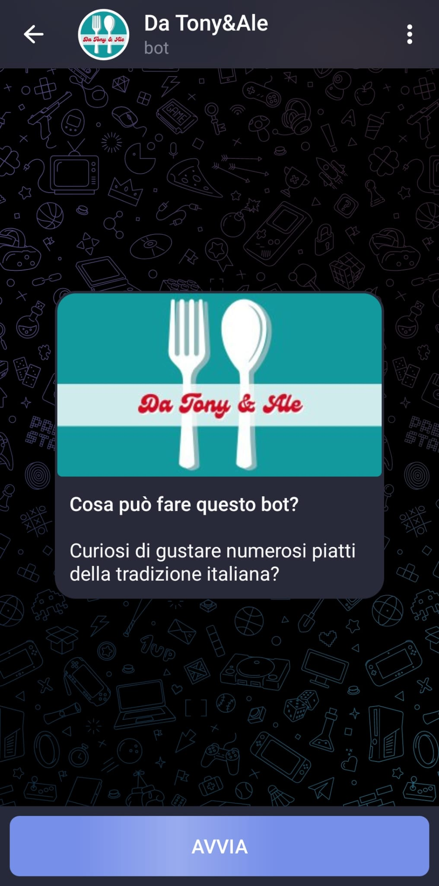
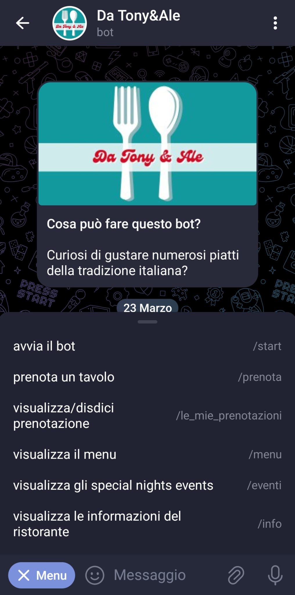
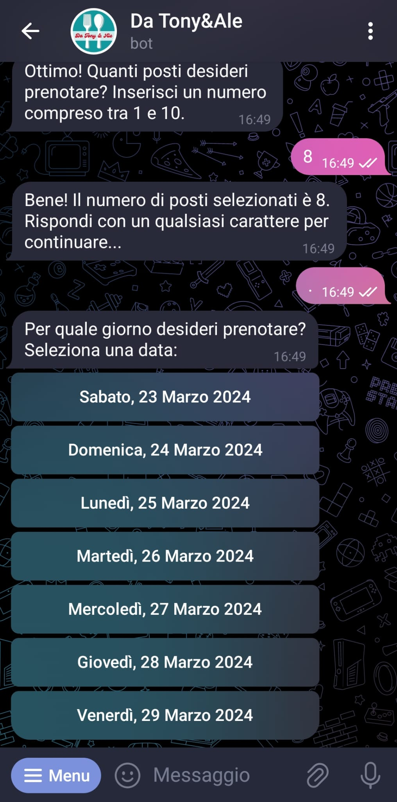
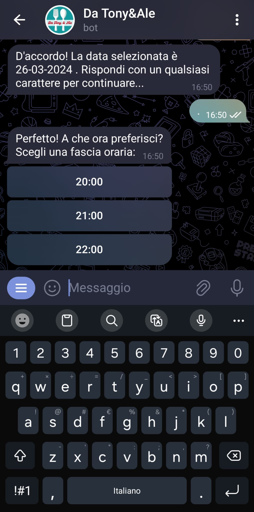
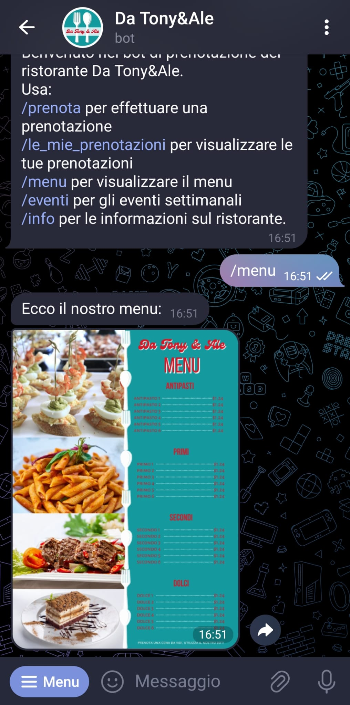
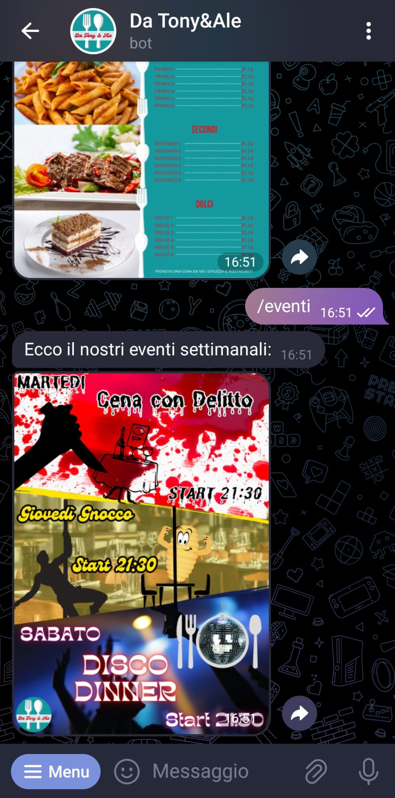
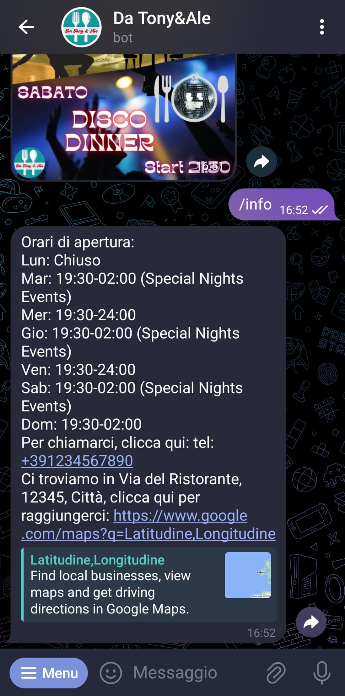

**RistoBot da Tony & Ale**

RistoBot è un progetto per il corso di Quality Development 2023/2024.
Si tratta di un bot Telegram progettato per semplificare la gestione delle prenotazioni per un certo ristorante.
Questo bot offre una piattaforma intuitiva per gestire le prenotazioni dei clienti in modo efficiente e organizzato.

**Cosa è stato realizzato**

Ciò che è stato realizzato è un bot Telegram, ovvero una applicazione eseguita sulla nostra macchina, la quale comportandosi da server estende le funzionalità del server di Telegram, al quale un utente può inviare comandi mediante l'interfaccia di chat messa a disposizione dal client di Telegram. Il comando viene reindirizzato alla nostra macchina che darà risposta tramite il server Telegram al client dal quale l'utente ha inviato il comando.

**Specifiche dell'applicazione RistoBot**

L’applicazione è destinata ai clienti e servirà a memorizzare i dati per le prenotazioni richieste dagli utenti stessi.
Le informazioni verranno memorizzate in una base dati configurata con MySQL, dove dei trigger opportunamente configurati si occuperanno di popolare e modificare i dati relativi a prenotazioni di clienti differenti.
L’utente potrà interagire con il bot tramite appositi comandi, in particolare potrà richiedere di visualizzare le prenotazioni effettuate e agire sulle singole prenotazioni eseguendo una cancellazione.

**Funzionalità Principali**

- **Prenotazioni**: I clienti possono effettuare prenotazioni direttamente tramite il bot Telegram, specificando data, ora e numero di persone ecc..
- **Gestione delle Prenotazioni**: I clienti in totale autonomia, possono visualizzare, confermare e cancellare le prenotazioni attraverso l’interfaccia gestita tramite bot.

**Funzionalità Secondarie**

- **Visualizzazione Menu**: I clienti possono visualizzare/scaricare il menu del ristorante.
- **Visualizzazione eventi in programma**: I clienti possono visualizzare/scaricare gli eventi in programma offerti dal ristorante.
- **Visualizzazione contatti**: I clienti possono visualizzare le informazioni di contatto del ristorante, quali ad esempio indicazioni stradali, contatto telefonico, ecc…

**WHAT’S NEXT**

In programma abbiamo l’implementazione di nuove feature come ad esempio:

- **Notifiche**: Il bot invia notifiche agli amministratori quando vengono effettuate nuove prenotazioni o quando vengono apportate modifiche alle prenotazioni esistenti

**SETUP per eseguire il bot**

- **XAMPP**: si può scaricare [qui](https://www.apachefriends.org/download.html), per configurare il database del bot.
  - Creare il database su mysql denominato “**qualitydev\_db**”.
  - Importare nel database il file **qualitydev\_db.sql** presente nel percorso **quality\_dev\RistoBOT.**
- Creare un bot telegram personalizzato, generare il token con il bot BOTFATHER
  - Non è necessario configurare i bottoni nel bot in quanto si generano automaticamente all’avvio del bot.
- Copiare il token all’interno del file di configurazione **config.py**, presente nel percorso **quality\_dev\RistoBOT\src\lib**
- Installare le dipendenze contenute nei file di requirements.txt, e se sei uno sviluppatore il file requirements\_dev .txt
- Avviare il bot eseguendo il file **RistoMain.py** presente alla radice del progetto
- Enjoy

**Descrizione dei comandi**

- **Avvio il Bot**: Il bot viene avviato utilizzando il comando **/start**.
  Il bot manda un messaggio di benvenuto.
- **Prenota un tavolo**:
  - Il comando **/prenota** avvia il processo di prenotazione, che passa attraverso diversi stati
    - NAME
    - PHONE
    - RESERVED\_SEATS
    - DAY
    - TIME\_SLOT
    - CONFIRMATION
    - BUTTON\_HANDLER
- per raccogliere le informazioni necessarie per la prenotazione (nome, telefono, numero di posti, data, slot orario, conferma).
- È possibile confermare la prenotazione tramite messaggio testuale.
- **Visualizza / Disdici prenotazione**:
- Il comando **/le\_mie\_prenotazioni** consente agli utenti di visualizzare e cancellare le proprie prenotazioni, sia singolarmente che tutte in una volta.
- **Visualizza il menu / Special Night Events**:
- I comandi **/menu** e **/eventi** consentono agli utenti di visualizzare il menu e gli eventi del ristorante.
- **Visualizza informazioni del ristorante**:
- Il comando /info fornisce informazioni aggiuntive sul ristorante, quali indicazioni stradali e contatti telefonici.

**Panoramica dei comandi del bot**

**Dipendenze del progetto**

**Per l’ambiente produzione**

- mysql-connector-python==8.1.0
- python-telegram-bot==20.6
- PILLOW==10.1.0

**Per l’ambiente DEV**

- coverage==7.3.2
- pytest==7.4.3
- pytest-asyncio==0.21.1
- pytest-mock==3.12.0
- pytest-cov==4.1.0
- pylint==3.0.2

**Contribuire**

Le collaborazioni sono benvenute! Se vuoi contribuire a questo progetto, segui questi passaggi:

- Fork del repository
- Crea un branch per la tua modifica (**git checkout -b feature/AmazingFeature**)
- Esegui commit delle tue modifiche (**git commit -m 'Add some AmazingFeature'**)
- Esegui il push del tuo branch (**git push origin feature/AmazingFeature**)
- Apri una **Pull Request**

**Autori**

- Antonino Cristaldi   à  <https://github.com/Antonino698>
- Alessandra Di Fiore à  <https://github.com/XeenAle>
